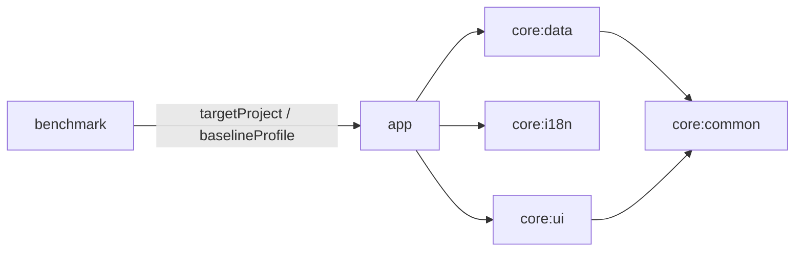

# 阶段 0：EhViewer 构建与迁移基线

审计日期：2026-10-10（Asia/Shanghai）。本报告以本地工作树与实际执行结果为准。

## 1. 范围与结论

仅审计、执行原始检查、建立复现材料。没有修改 application/native 源码、Gradle 配置、依赖版本、工作流、包名、签名或数据库；没有提交、合并、push、创建 tag 或发布 APK。

用户本轮要求优先于附件中的示例提示词：允许 Android-only KMP，但不要求其他平台；本次只做 P0。附件中禁止 KMP 的文字不能覆盖用户请求，也没有执行附件中的 P1–P10 指令。

**审计基线已建立；完整 Android Debug/Release 构建未通过。** 原始构建首先因缺少 ARM32 Rust target 失败；补齐后停在 Nettle `.bootstrap`，本机没有 `autoconf`。不通过修改源码绕过该问题。

**另有三项已确认的重要事实：**

- 当前实际 Java/Kotlin Android 字节码目标是 **25**，不是仅 Gradle 运行 JDK 为 25。Gradle 模型和已生成 class 的 major version 69 均已验证；后续工具链阶段需按用户约束处理。
- 原始 GIF 处理对 7 字节 GIF 输入产生 heap-buffer-overflow，已用 ASan 复现。
- 原始归档 JNI 接收非 ASCII 密码时产生 `StringIndexOutOfBoundsException`，已用真实宿主 JVM/JNI 复现。

## 2. Git 身份与分支

| 项目 | 实测结果 |
| --- | --- |
| 仓库 | `/Users/zhanziyuan/Documents/GitHub/EhViewer` |
| 起始/结束 HEAD | `c5156a2de34e08fe9d11acd0f7552f6b8189a5db` |
| Git tree | `8ae62af434f702c2c5e12d82141af79242e490fa` |
| 工作分支 | `feature/rusty` |
| main 与 feature/rusty | 已存在且均指向上述 HEAD；`git rev-list --left-right --count main...feature/rusty` 为 `0 0` |
| 初始工作区/暂存区 | 干净 |
| 结束变更 | 仅新增本报告及同目录下的审计复现材料，详见 `baseline/files.txt` |
| 本地 origin | `https://github.com/ZhanZiyuan/EhViewer.git`；未 fetch/push，远程分支新鲜度未验证 |
| 已有 tag | HEAD 已有 `1.15.0` tag；本次未创建或修改 |
| submodule | `git submodule status` 无条目 |

无需重建或覆盖已经存在的 `feature/rusty`；已确认它正是基于本地 main 的工作分支。没有删除分支或重置工作树。未找到适用的 AGENTS.md。

参考文档所称 `b9729e9` 是历史提交。当前 main 已在其后包含版本准备、手动发布、tag 必须合入 main 的三个提交：`c82331918`、`4968dabd5`、`c5156a2de`。不能据旧快照重新升级或撤销已有改动。

## 3. 工具链与 SDK 的定义源

| 配置 | 当前值 | 定义或证据 |
| --- | --- | --- |
| Gradle | 9.7.1 | `gradle/wrapper/gradle-wrapper.properties`；`./gradlew --version` 实测 |
| 运行 JDK | 25.0.3，JetBrains JBR | `JAVA_HOME=/Applications/Android Studio.app/Contents/jbr/Contents/Home`；daemon 日志及模型 |
| CI JDK | 25，Temurin | `.java-version` + `actions/setup-java@v5` |
| AGP/settings plugin | 9.3.1 | `gradle/libs.versions.toml`、`settings.gradle.kts` |
| Kotlin / Compose compiler | 2.4.10 | 版本目录；Compose compiler 与 Kotlin 同版本 |
| KSP | 2.3.9 | 版本目录；app destinations、core:data Room |
| Room | 2.8.4 | 版本目录、core:data Gradle 与 schema |
| Compose Multiplatform | 1.11.1 | core:ui convention；Android-only target |
| Compose BOM | `androidx.compose:compose-bom-alpha:2026.08.00` | 不是稳定 BOM 坐标；material3 显式 1.9.0，adaptive 1.2.0 |
| Benchmark / baselineprofile | 1.5.0-rc01 | 版本目录，benchmark 模块与 app 插件 |
| compileSdk / targetSdk | 37 / 37 | `settings.gradle.kts` 全局 Android settings |
| 全局 minSdk | 24 | `settings.gradle.kts`；core 库使用该最低版本 |
| app default Flavor minSdk | 26 | `app/build.gradle.kts`；已生成 defaultDebug Manifest 验证 |
| app marshmallow Flavor minSdk | 继承 24 | 名称不代表实际 API 23；已生成 marshmallowRelease Manifest 可复查 |
| Build Tools | 37.0.0 | settings；首次构建自动安装 |
| NDK | 29.0.14206865 | settings；首次构建自动安装 |
| Android CMake | SDK 内 3.22.1 | 实际 configure/build 命令；Gradle 未显式 pin CMake 版本 |
| 宿主 CMake / Clang | 4.4.4 / Apple Clang 21.0.0 | 仅宿主工具库存；Android 构建使用 NDK Clang |
| Rust | nightly-2026-08-22，rustc 1.100.0-nightly | `rust-toolchain.toml`；实测 commit `c656540d6467dee1381f0cbd882412d6bd1cd5ae` |
| Rust targets | aarch64-linux-android、x86_64-linux-android；CI 另加 thumbv7neon-linux-androideabi | 本次补齐 ARM32 target |

### 字节码证据

`baseline/model.init.gradle` 是仓库外执行的只读审计任务，不注入生产构建配置。结果存于 `baseline/evidence/gradle-model.log`：

```text
P0_RUNTIME_JAVA=25.0.3
P0_JAVA=:app source=25 target=25
P0_JAVAC=:app:compileDefaultDebugJavaWithJavac target=25
P0_KOTLIN=:app:compileDefaultDebugKotlin jvmTarget=JVM_25
P0_KOTLIN=:app:compileDefaultReleaseKotlin jvmTarget=JVM_25
P0_KOTLIN=:core:common:compileAndroidMain jvmTarget=JVM_25
P0_KOTLIN=:core:data:compileAndroidMain jvmTarget=JVM_25
P0_KOTLIN=:core:i18n:compileAndroidMain jvmTarget=JVM_25
P0_KOTLIN=:core:ui:compileAndroidMain jvmTarget=JVM_25
```

`jvmToolchain(libs.versions.java)` 出现在 app convention、KMP convention、build-logic 和 benchmark；没有显式隔离 Android `jvmTarget`/Java target。`javap` 对 core:common `PathsKt.class` 和 app `BuildConfig.class` 确认 major version 69。不能把它们报告为 Java 17。

现有 `jvmToolchain` 是 Gradle/Kotlin 插件的 Java 工具链 DSL，构建入口始终是 Gradle Kotlin DSL；本次没有引入或切换工具链机制。

### 官方兼容性核验（2026-10-10）

AGP 9.3 支持 API 37，最低 Gradle 9.5.0，JDK 最低 17；当前 Gradle 9.7.1 满足该最低版本。API 37 最低 AGP 9.1.1 的约束仍成立。[Android AGP 兼容表](https://developer.android.com/build/releases/about-agp)、[AGP 9.3 release notes](https://developer.android.com/build/releases/agp-9-3-0-release-notes)。

Gradle 9.1+ 支持在 JDK 25 运行；本机已实测 Wrapper/任务发现成功。[Gradle Java 兼容表](https://docs.gradle.org/current/userguide/compatibility.html)。

Kotlin 工具链会影响隐式 JVM target；AGP 内置 Kotlin 的默认 target 也与 Android compileOptions 相关。app convention 未应用旧 `org.jetbrains.kotlin.android`；core 使用 Android KMP library 插件。[Kotlin 工具链说明](https://kotlinlang.org/docs/gradle-configure-project.html#gradle-java-toolchains-support)、[AGP 内置 Kotlin 迁移](https://developer.android.com/build/migrate-to-built-in-kotlin)。

现有组合已通过 Gradle 配置、app/defaultDebug Kotlin+Java 编译、Compose compiler、destinations KSP 和 Room KSP 编译路径。**完整 Release R8/D8、打包、设备行为未验证，不能由版本表推定全部兼容。**

## 4. Wrapper 与依赖可重复性

- Wrapper JAR 已纳入 Git。SHA256 为 `7a9ce74cff467ca1bf60a4fcd9f05185acceda4d0f382434d393e17864262c5d`，与本次从 [Gradle 官方 checksum](https://services.gradle.org/distributions/gradle-9.7.1-wrapper.jar.sha256) 取得的值相同。
- `validateDistributionUrl=true`，networkTimeout 10000ms，retries 0；尚无 `distributionSha256Sum`。JAR 校验通过不代表发行 ZIP 已配置独立校验。
- 所有构建 workflow 已使用 setup-gradle v6，未禁用其默认 Wrapper 校验。[v6 action 定义](https://raw.githubusercontent.com/gradle/actions/v6/setup-gradle/action.yml)。本次没有运行 GitHub Actions，不能声称远程 Wrapper 校验 job 通过。
- Cargo.lock 已跟踪，Corrosion 使用 `LOCKED`；原 CI 的 clippy 未加 `--locked`，本地审计使用它以防锁文件变化。
- `tl` Git revision 为 `051705e41fcc140bcb6affcca687589333976296`；libwebp-sys2 为 `138c7114eb7cc9c3d0a6c5d074d1dda30550b765`。
- 未发现 Gradle dependency lockfile/verification-metadata。版本目录固定声明版本不等同于完整依赖锁定；默认 Debug 实际解析图见 `gradle-unit-dependencies.log`。
- CMake FetchContent/ExternalProject 使用 Git tag、浅克隆，当前依赖首次构建需要网络。后续应评估不可变 revision 和校验，P0 未调整。

## 5. 模块与产品身份



`settings.gradle.kts` 包含 app、benchmark、core:common/data/i18n/ui；build-logic 为 included build。四个 core 模块已经使用 commonMain/androidMain 和 KMP convention，仅配置 Android target；desktop target 仅有注释，没有 iOS/桌面产物。P0 不移除现有 KMP，也不新增平台。

| 身份/产物 | 当前值 |
| --- | --- |
| 默认 Release applicationId | `moe.tarsin.ehviewer` |
| namespace / Kotlin JNI 包 | `com.hippo.ehviewer` / `com.hippo.ehviewer.jni` |
| Debug | 默认包名加 `.debug`；本次 merged Manifest 实测 |
| Marshmallow | `.m` 后缀，versionName 加 `-M`；不能覆盖默认包保留该包的数据 |
| benchmarkRelease | `.benchmark`，debug signing |
| versionCode | `180064`，当前固定整数；未找到 ABI/flavor 自动进位或 versionCodeOverride |
| versionName | `1.15.0-SNAPSHOT`；传 `-Prelease` 为 `1.15.0` |
| Release ABIs | arm64-v8a、armeabi-v7a、x86_64 + universal |
| 单独 Debug 调用 | arm64-v8a、x86_64，无 universal |
| Flavor | 维度 `api`，仅 `default` / `marshmallow`；benchmark 也声明两者 |
| build types | release、debug、benchmarkRelease；baselineprofile 插件还产生 nonMinifiedRelease 等任务 |
| 核心数据库 | `eh.db` schema 23；`search_database.db` schema 2；历史 schema 和迁移保持不变 |
| 密码偏好 | 现有 `archive_passwds` string set；没有读用户实际偏好或修改存储 |

`isRelease` 用启动参数中是否含大小写匹配的 `Release` 判断，**同一次调用中出现 Release 会改变 Debug 的 splits 和 ndkFilters**。本次联合 Debug/Release 构建因此也给 Debug 配置三 ABI + universal；它不是单独 Debug 的标准产物组合。这是后续脚本和构建可重复性风险。

Release 使用已跟踪的 `app/keystore/androidkey.jks`，alias `key0`，开启 V3/V4；keystore 口令直接写在现有 Gradle 脚本中（报告不重抄口令）。读取证书的 SHA256：`5D:91:DF:F1:3B:64:89:A9:CF:AD:BB:19:7B:3E:79:5E:EF:C8:C3:9F:84:9C:45:43:F3:2C:16:07:20:FB:40:A6`。未导出私钥或更换签名。证书可读不等于已验证 APK 签名/历史安装包签名一致；缺少 APK 和设备升级样本。

## 6. Native 调用图与迁移范围

```text
Gradle app.externalNativeBuild -> app/src/main/cpp/CMakeLists.txt
  libehviewer.so = archive.c + gifutils.c + hash.c + natsort/strnatcmp.c
    -> archive_static (libarchive 3.8.7 + 两个本地 patch)
       -> liblzma (xz 5.8.3) + libnettle (nettle_4.0_release_20260205)
    -> ehviewer_rust staticlib (Corrosion fork v0.6.1, ../rust/Cargo.toml)
       -> android / jnigraphics / log / libwebp 1.6.0 / webpdemux
```

CMake 最低版本声明 3.14，不等于实际所用 3.22.1。非 Debug C 编译带 Polly/LTO；Rust Release 使用 nightly `-Z build-std`、immediate-abort 等选项。API>=26 选 `android-26` feature，较低 API 选 `android`。最终导出脚本只公开 `JNI_OnLoad`、`Java_*`，链接通过 `-u JNI_OnLoad`/`--undefined-glob` 保留 JNI 符号。

Rust 当前是单 staticlib crate，parser/image 与 `ffi/jvm.rs`、`ffi/android.rs`、`ffi/android_o.rs` 共存；并非已完成 Core/JNI 分层。但无默认 Android feature 的宿主 parser 测试已经可编译，可作为后续分层入口。`jni_throwing` 将 Result 错误转为 Java RuntimeException，未见 catch_unwind；不能据此保证所有 panic 都被屏蔽。

| 原生接口 | 当前实现与上层 |
| --- | --- |
| HashKt.sha1(fd) | C + Nettle SHA-1，返回小写 hex，读取当前位置到 EOF、不关闭 fd |
| GifUtilsKt.isGif / rewriteGifSource / mmap / munmap | C；直接缓冲、文件描述符和映射生命周期由 Kotlin 配合 |
| ArchiveKt.openArchive / closeArchive | C；全局单 session，不是句柄式实例 |
| ArchiveKt.extractToByteBuffer / releaseByteBuffer | C；stored archive 可零拷贝，其他路径使用 buffer pool |
| ArchiveKt.extractToFd / getExtension | C；JNI index 对应排序后的条目 |
| ArchiveKt.needPassword / providePassword | C + libarchive passphrase |
| ArchiveKt.archiveFdBatch | C；ZIP store 写入，fd 由调用方持有 |
| parser / WebP / detectBorder / hasQrCode / HardwareBuffer copy | 既有 Rust JNI；保持类名、方法名、参数与 feature 条件 |

C 侧 14 个 JNI 导出已经在宿主 dylib 中用 `nm` 核对；Rust 源码通过 `jni_fn` 宏另导出 parser/image 接口。**没有最终 Android .so，尚未核对 Android 全部 JNI 导出、重复符号或设备加载。** `EhApplication` 调用 `System.loadLibrary("ehviewer")`，库名须保持。

libarchive 显式启用 TAR/7z/RAR5/ZIP 和 gzip/xz filter，并设置 ZIP `ignorecrc32=1`；不能把损坏包一概期望为 CRC 拒绝。图片条目扩展名白名单区分大小写，当前 `UPPER.JPG` 会排除。自然排序代码带 Martin Pool 的第三方来源/许可证声明，属于仓库内维护的 vendored 实现，不能称原作者为 EhViewer。

归档全局状态有 ctx pool 20、decode buffer pool 4、两个 mutex、密码/entries/mmap 等；Kotlin ArchivePageLoader 使用 auto-close scope，但并未使 C 自带多 session 隔离。迁移时需保留排序开关、随机访问、fd 偏移、buffer 释放和上下文生命周期语义。

## 7. CI 与 Release 当前行为

| 工作流 | 实际任务/触发/产物 |
| --- | --- |
| `.github/workflows/ci.yml` | check/default/marshmallow 三 job；fmt、Android aarch64 clippy、build-logic check、spotlessCheck、lintMarshmallowRelease、assembleDefaultRelease、assembleMarshmallowRelease；CI 只上传三种 split APK，不上传 universal；另上传两套 mapping/symbols |
| `.github/workflows/baseline-profile.yml` | 定时/手动/benchmark 路径 push；generateBaselineProfile；失败报告 |
| `.github/workflows/releases.yml` | tag push 或手动指定已有 tag；regex 校验，完整 checkout，验证 tag 已合入 origin/main；generateBaselineProfile 与 assembleRelease 均带 -Prelease；contents:write；softprops/action-gh-release@v3 |
| `.github/workflows/lock-threads.yml` | issue 定时锁定，issues:write；与迁移构建无关，未执行 |

CI/build/profile/release 的 setup-gradle 都已是 v6。CI 尚无 Rust unit test、Android 功能回归、16KB 检查；CI 的默认权限取决于远程仓库设置，不能从本地文件断言只读。`push.branches: ['*']` 不匹配包含 `/` 的 `feature/rusty`，PR/手动触发仍可用。[GitHub 官方过滤规则](https://docs.github.com/en/actions/reference/workflows-and-actions/workflow-syntax#filter-pattern-cheat-sheet)。本次未触发任何 workflow。

当前 Release regex 不接受 `v` 前缀，允许 3/4 段版本及 prerelease；没有验证 tag 版本与 Gradle versionName 一致。`fail_on_unmatched_files=true` 只检查声明文件匹配，不是目录内附件数量/签名/ABI/版本的完整验收。

### 当前 12 个自定义附件与目标 4 个的差异

其中 `V` 表示现有 RELEASE_TAG，`x.y.z` 表示后续经规范化验证的发布版本。

| 当前附件 | 数量 | 目标动作 |
| --- | ---: | --- |
| `EhViewer-V-default-arm64-v8a.apk` | 1 | 改为 `EhViewer-x.y.z-arm64-v8a.apk` |
| `EhViewer-V-default-armeabi-v7a.apk` | 1 | 改为 `EhViewer-x.y.z-armeabi-v7a.apk` |
| `EhViewer-V-default-universal.apk` | 1 | 改为 `EhViewer-x.y.z-universal.apk` |
| `EhViewer-V-default-x86_64.apk` | 1 | 改为 `EhViewer-x.y.z-x86_64.apk` |
| `EhViewer-V-marshmallow-{arm64-v8a,armeabi-v7a,universal,x86_64}.apk` | 4 | 移除 |
| `EhViewer-V-{default,marshmallow}-mapping.txt` | 2 | 继续生成，保存到访问受控的内部存储，不公开上传 |
| `EhViewer-V-{default,marshmallow}-native-debug-symbols.zip` | 2 | 同上，保留版本与校验关联 |
| GitHub 自动 Source code zip/tar.gz | 不计入自定义附件 | GitHub 自动提供，不另打包上传 |

这是 **workflow 的配置清单**，未查询或声称远程 Release 实际已上传 12 个文件。公共 Actions artifacts 的访问控制尚未验证，不能作为“私密”内部存储的证明。

### 实际输出与路径证据

目前 `app/build/outputs` 只有日志，没有 APK、mapping 或 native-debug-symbols。Release 工作流引用以下路径，**是待验证的配置路径，不是成功产物**：

```text
app/build/outputs/apk/{default,marshmallow}/release/app-{flavor}-{abi}-release.apk
app/build/outputs/mapping/{default,marshmallow}Release/mapping.txt
app/build/outputs/native-debug-symbols/{default,marshmallow}Release/native-debug-symbols.zip
```

已实际生成 defaultDebug 与 marshmallowRelease 的 merged Manifest；defaultDebug packaged-manifest metadata 的变体路径、包名、versionCode、ABI filters 已保存。**它的 artifactType 是 PACKAGED_MANIFESTS，不能冒充 APK metadata。** 删除 Flavor 后的 APK 输出路径仍需以新构建 metadata 确认。

## 8. 实际执行记录

所有 Gradle 命令均使用仓库 `./gradlew`。审计缓存设为 `GRADLE_USER_HOME=/private/tmp/ehviewer-p0-c5156a2/gradle-home`，Android 构建显式设置 `ANDROID_HOME=/Users/zhanziyuan/Library/Android/sdk`。Rust 宿主/Clippy 使用独立 `CARGO_TARGET_DIR=/private/tmp/ehviewer-p0-c5156a2/cargo-target`。完整日志在 `baseline/evidence/`。

| 命令/检查 | exit | 实际结果 |
| --- | ---: | --- |
| git status/rev-parse/branch/log/rev-list/submodule/diff | 0 | 身份/干净基线核对；审计前 tracked diff 为空 |
| ./gradlew --version，首次沙箱运行 | 1 | DNS 解析 services.gradle.org 失败；获准联网重试 |
| ./gradlew --version，重试 | 0 | Gradle 9.7.1，JDK 25.0.3 |
| ./gradlew tasks --all --console=plain --no-daemon | 0 | BUILD SUCCESSFUL，真实任务清单已保存 |
| ./gradlew p0BuildModel --init-script 临时模型脚本 --offline --no-configuration-cache --console=plain --no-daemon | 0 | 读最终 SDK/Java/Kotlin target，未改源码 |
| cargo fmt --all -- --check | 0 | 无差异 |
| cargo test --locked --offline --lib -- --skip test_parse_info --skip test_parse_profile --skip test_parse_gallery_detail | 101 | 首次缺 libwebp-sys2 Git 缓存 |
| 同上去掉 --offline 后重试 | 0 | 3 passed / 3 filtered out；宿主构建有 3 个 dead_code warning |
| cargo clippy --locked --offline --target aarch64-linux-android --all-features -- -D warnings | 101 | 缺 Android 专用依赖缓存 |
| 同上去掉 --offline 后重试 | 0 | Android aarch64 静态检查通过，非链接/设备测试 |
| ./gradlew :build-logic:convention:check spotlessCheck --offline --console=plain --no-daemon | 1 | 缺 ktlint-cli 1.8.0 缓存，表现为 configuration-cache 写入失败 |
| 同上去掉 --offline 后重试 | 0 | Spotless/build-logic check 通过；build-logic:test 是 NO-SOURCE |
| ./gradlew :app:assembleDefaultDebug :app:assembleDefaultRelease -Prelease --console=plain --no-daemon | 1 | 第一次缺 thumbv7neon target，5m9s；补齐后第二次 Nettle 缺 autoconf，1m52s |
| ./gradlew :app:testDefaultDebugUnitTest :core:{common,data,i18n,ui}:testAndroidHostTest :app:dependencies --configuration defaultDebugRuntimeClasspath --continue --console=plain --no-daemon | 0 | 实际执行时 core 四个任务逐项展开；所有测试为 NO-SOURCE，**0 项 Kotlin 单元测试**；app/Compose/KSP/Room 编译和依赖图导出通过 |
| ./gradlew :app:lintMarshmallowRelease --console=plain --no-daemon | 0 | BUILD SUCCESSFUL，2m13s；SARIF 有 45 项 warning、无 error；未自动修复 |
| 宿主 native_baseline.py，最终版（含 fixture seed） | 0 | 22 个排序输入/484 pairs，5 个安全 GIF 向量，210 项真实 JVM/JNI 检查通过；两个缺陷另行确认 |
| GIF 7 字节输入 sanitizer 子进程 | -6（SIGABRT） | AddressSanitizer heap-buffer-overflow；预期复现原有缺陷 |
| 非 ASCII 密码 JNI 子进程 | 1 | StringIndexOutOfBoundsException；预期复现原有缺陷 |
| javap / nm / keytool / 官方 Wrapper SHA 比较 | 0 | class major69；宿主 C JNI14 exports；证书指纹可读；Wrapper 相符 |
| adb devices -l | 0（重试） | 首次沙箱端口受限；获准重试后列表为空，没有可用设备 |

### 宿主 Native 基线的边界

复现脚本直接编译仓库原有四个 C 文件。仅在测试临时目录提供 Android log stub、NDK jni.h，并通过编译宏将 `stat64/fstat64/mmap64` 映射为 macOS 同类 API；**没有复制改写算法或修改生产文件**。

宿主链接 Homebrew libarchive **3.8.9**、Nettle **4.0**；Android 声明的 libarchive 是 **3.8.7 + patches**。因此宿主结果是原有 C/JNI 语义的可重复证据，不代表 Android 原生全链通过。fixture payload 是用于验证解压字节的极小合成数据，不是图像解码验收样本。

- 排序：空串、数字 2/10、前导零、大小写、空格、UTF-8 文件名、160+ 位数字；保存 pairwise sign oracle，并检查反对称/传递性。
- SHA-1：空文件、abc、超过 8192 字节分块的数据、非零 fd 起始偏移；核对 Java MessageDigest 与 fd 终点。
- GIF：87a/89a、非 GIF、短文件、延迟改写、DirectByteBuffer、mmap/munmap；7 字节缺陷单独在 ASan 子进程复现。
- Archive：stored/deflated ZIP、TAR、7z；ASCII AES256 ZIP/ZipCrypto 的错误/正确密码；排序开关；跳页/重复读取；buffer release、extractToFd；坏 ZIP；ZIP store 写入并重新打开。
- 非 ASCII 密码输入使用 ASCII 加密 ZIP 验证 JNI 入参处理异常，**未验证 Unicode 密码成功解密**。早先尝试用本机 7zz 生成 Unicode ZIP 返回 E_INVALIDARG，故没有把生成失败归咎于 app，也没有伪造 Unicode 成功样本。
- 宿主脚本最早一次因 JBR 无 jni.h 编译失败；最终改为使用本机既有 NDK 头。最终版在新临时输出目录复跑成功。

脚本返回 0 表示普通检查通过且已成功刻画两个已知缺陷，**不表示缺陷已修复**。P5/P6 应保留原始证据，并为新实现建立对应差分与正确行为验收；不能把旧实现的越界/异常当成新实现必须保留的行为。

### 复跑方式

在仓库根目录运行（需 macOS arm64、Python3、Clang、JDK25、宿主 libarchive/nettle；归档 seed 已保留，因此复跑无需重新生成加密归档）：

```sh
python3 docs/modernization/baseline/native_baseline.py \
  --repo "$PWD" \
  --output /private/tmp/ehviewer-p0-recheck \
  --fixture-seed docs/modernization/baseline/fixtures \
  --jni-header /Users/zhanziyuan/Library/Android/sdk/ndk/27.1.12297006/toolchains/llvm/prebuilt/darwin-x86_64/sysroot/usr/include/jni.h

ANDROID_HOME=/Users/zhanziyuan/Library/Android/sdk \
GRADLE_USER_HOME=/private/tmp/ehviewer-p0-c5156a2/gradle-home \
./gradlew p0BuildModel \
  --init-script docs/modernization/baseline/model.init.gradle \
  --offline --no-configuration-cache --console=plain --no-daemon
```

fixture SHA256、source SHA256、Wrapper 官方 checksum、排序 oracle、日志、Manifest/metadata 和精确新增文件清单均保留在 `baseline/`。加密归档有随机盐且 7z 含生成时元数据，后续差分应复用 seed 字节并校验 SHA256，不应假定重新生成后字节相同。

## 9. 未验证项目与最小风险清单

| 风险/缺口 | 证据与后续处理 |
| --- | --- |
| Android native 构建受宿主依赖阻塞 | `.bootstrap: autoconf: command not found`；需安装提供 autoconf/autoheader 的宿主包（例如 Homebrew autoconf），验证 PATH 后原命令重跑；本次未安装该系统包 |
| Android bytecode 25 | 模型及 Java/Kotlin class major69 已证实；P1 显式区分运行 JDK 与 Android 字节码，选经验证的兼容目标；P0 不修配置 |
| 7 字节 GIF 越界 | ASan 已复现；P5 修边界并补损坏输入/非 direct buffer 验收 |
| Unicode 密码 JNI 长度混淆 | GetStringUTFLength 的字节数被传给 GetStringUTFRegion 的 UTF-16 长度参数；P6 修复并验证多字节/非 BMP/错误密码语义 |
| hash/read 错误 | `read()` 的负返回存进 size_t；archiveFdBatch 也使用 size_t read；仅静态发现，未运行会产生未定义行为的 invalid-fd 用例 |
| 归档全局资源/安全/并发 | 全局单 session、index/size/错误分配路径、上下文替换与 buffer 生命周期；需要 Android sanitizer、并发/泄漏、大文件/炸弹测试，未验证 |
| 全格式与密码 | RAR5、加密7z、加密头、Unicode 成功解密、大归档/坏包广泛矩阵未验证；不能把宿主 ZIP 测试扩展称全部格式通过 |
| Android ABI/16KB | Rust aarch64 clippy 与宿主 JNI 不等于 Android .so 链接；未产 APK，ELF LOAD/ZIP 16KB 对齐、符号、加载全部未验证 |
| API26/29/33/35/37 | 没有连接设备；API35 x86_64 benchmark managed image 未部署；没有安装/升级/启动测试 |
| 核心用户能力 | 登录/Cookie、网络/TLS/WebView、阅读/缩放/GIF/WebP 图像、下载/通知/后台恢复、数据库升级与用户数据保留均未验证 |
| target37 行为 | 已设置37但没有验收证据；后续重点在真实使用的 WebView、通知/dataSync foreground service、存储/SAF、Native 加载；不凭提示词添加权限 |
| Release | 没有 APK SHA256/签名/真实 APK metadata/性能基线；mapping/symbols 生成及受控存储未验证；tag 与代码 versionName 一致性未检验 |
| 现有测试空缺 | Kotlin test task 全部 NO-SOURCE；Rust 三项联网测试未执行；baseline profile 有联网/UI/语言文本依赖，未运行 |
| 供应链/许可 | vendored natural sort 来源、GPLv3 LICENSE 与第三方 patch/库声明需保留；未完成法律/公开发行权利审查，不代表获得发行授权 |

## 10. 后续阶段入口与回滚

推荐顺序（仅建议，**未执行**）：

1. P1 工具链：先补宿主 autoconf/autoheader，恢复原始 Debug/Release 基线；处理现有 Android bytecode25，验证当前 AGP9.3.1/Gradle9.7.1/Kotlin/KSP 组合，避免无依据降级或重复“升级”。
2. P2 SDK/Flavor：compile/target37 已存在，重点是统一 min26、删除 api/default/marshmallow 并同步 benchmark/任务调用；守住默认 applicationId/versionCode/签名。
3. P3 target37 行为验收：已有 target37，执行设备和核心功能适配，不把已配置视作已验收。
4. P4 CI：保留已完成的 setup-gradle v6，补依赖/Wrapper ZIP 校验、单元/Native 测试、最小权限、分支触发等实际缺口。
5. P5 hash→sort→GIF；P6 archive；P7 Core/JNI 分离；每阶段保留本基线并补 Android 等价/资源安全测试。
6. P8 Kotlin/目录；P9 四 APK Release dry-run（可在 Flavor 删除后独立开展）；P10 总验收。任何阶段均需用户另行指定。

P0 已完成源码/配置审计、真实命令记录、宿主原实现可重复基线和阻塞清单；原始 APK/设备完整基线仍未满足，不得把它写为通过。

回滚无需重置代码：HEAD 与 main 保持 `c5156a2de34e08fe9d11acd0f7552f6b8189a5db`。可将本次新增的 `docs/modernization/` 审计材料移至仓库外保留，原源码仍等于该提交；没有需要回退的生产配置。以后若单独提交本报告，可使用普通 `git revert <该报告提交>`。不要 reset --hard、git clean、删除历史、强推或覆盖已有原始恢复归档。

环境副作用：在已获准的基线检查中下载 Gradle9.7.1 到独立临时缓存、安装仓库指定 nightly/组件/Android Rust targets，并由 AGP 按既有许可自动安装 SDK37/BuildTools37/NDK29；产生被忽略的 build/.gradle/.cxx/.kotlin 等缓存。它们不属于源码变更，也无需删除以回滚本报告；最终仍缺 autoconf。原始 Software Heritage 恢复归档未提供路径，本次未查找或覆盖它。
